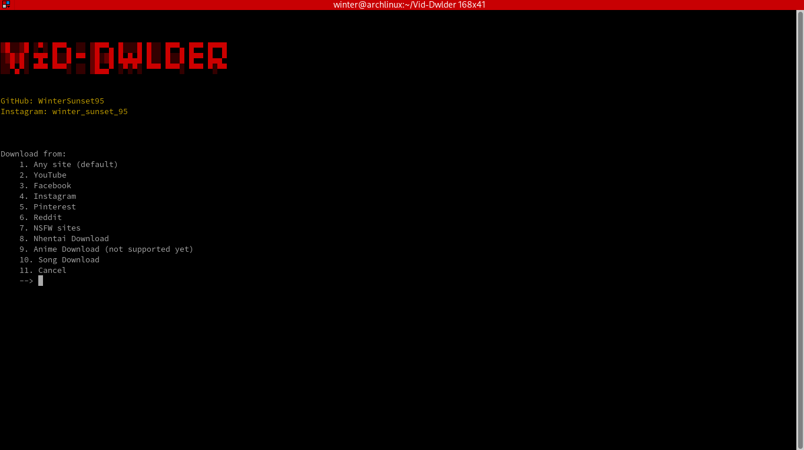
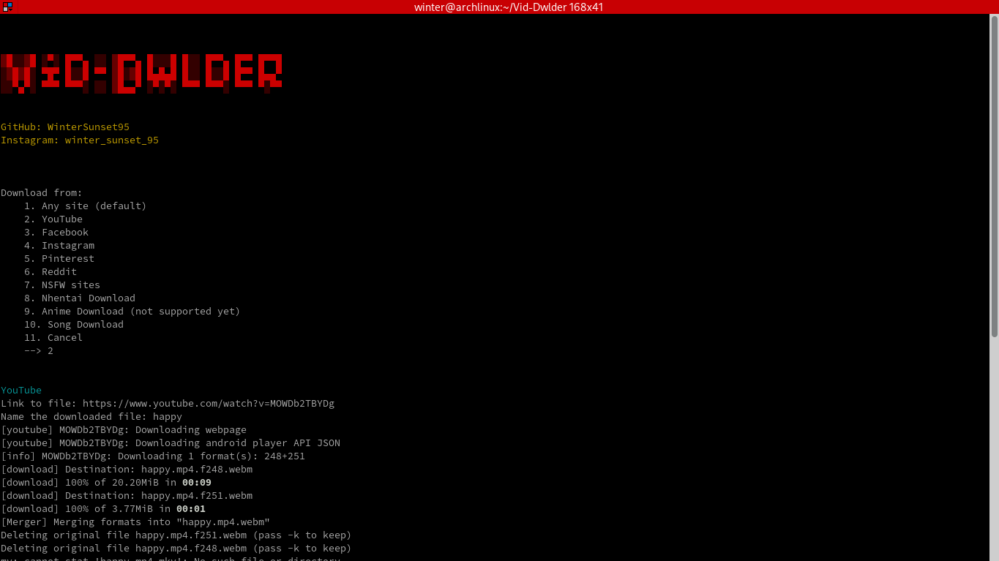
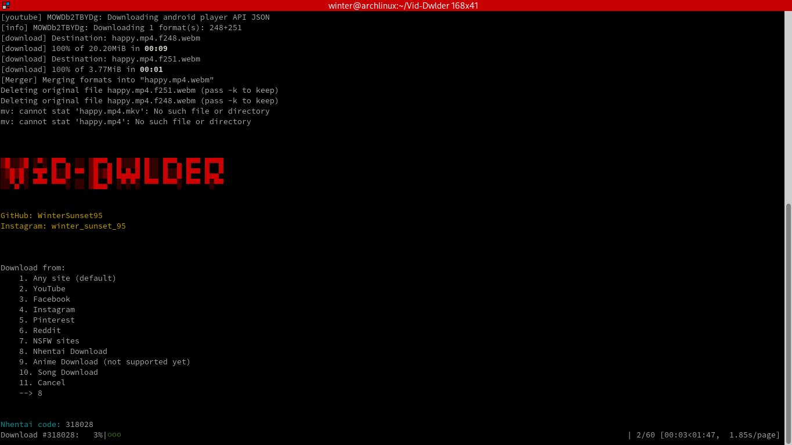

# <h1>Vid-Dwlder</h1>
# About
* An all-in-one video download tool<br>
* Uses <a href='https://github.com/ytdl-org/youtube-dl'>youtube-dl</a>.
* Available for termux and most linux systems
<br><br>
# Goals
✅ Download videos using url<br>
✅ Add support for at least 20+ popular websites<br>
✅ Download mp3 format<br>
✅ Download m8u8 playlists<br>
✅ Attractive interface<br>
❌ Anime downloader<br><br>
# Installation
-- Clone this repository and run the install.sh script.<br>
-- Or copy-paste the following:<br>
* Termux
```
pkg update && pkg upgrade && pkg install git -y && git clone https://github.com/WinterSunset95/Vid-Dwlder.git && cd Vid-Dwlder && bash install.sh
```
* Debian 
```
sudo apt update && sudo apt upgrade -y && sudo apt install git -y && git clone https://github.com/WinterSunset95/Vid-Dwlder.git && cd Vid-Dwlder && bash install.sh
```
* Arch-based distros
```
sudo pacman -Sy && sudo pacman -S git && git clone https://github.com/WinterSunset95/Vid-Dwlder.git && cd Vid-Dwlder && bash install.sh
```
# Screenshots
<hr>



<hr>

